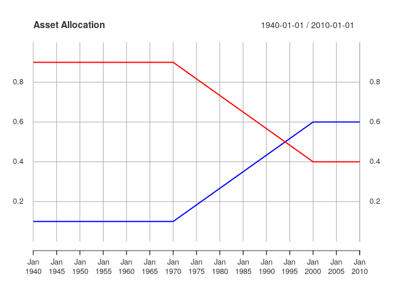
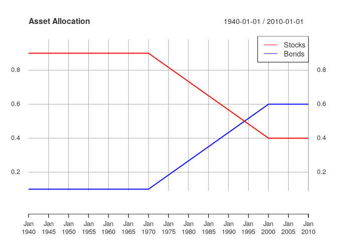

<!-- README.md is generated from README.Rmd. Please edit that file -->

# investmentsim

<!-- badges: start -->

[](https://travis-ci.org/ryanholbrook/investmentsim)
<!-- badges: end -->

investmentsim is an R package for simulating an investment portfolio
using either historical or simulated returns. It has support for varying
transactional and allocation paths.

## Installation

You can install the development version from
[GitHub](https://github.com/) with:

``` r
# install.packages("devtools")
devtools::install_github("ryanholbrook/investmentsim")
```

## Example

See the vignette *Basic Usage* for more detail.

``` r
library(tidyverse)
#> ── Attaching packages ────────────────────────────────── tidyverse 1.2.1 ──
#> ✔ ggplot2 3.2.1     ✔ purrr   0.3.2
#> ✔ tibble  2.1.3     ✔ dplyr   0.8.3
#> ✔ tidyr   0.8.3     ✔ stringr 1.4.0
#> ✔ readr   1.3.1     ✔ forcats 0.4.0
#> ── Conflicts ───────────────────────────────────── tidyverse_conflicts() ──
#> ✖ dplyr::filter() masks stats::filter()
#> ✖ dplyr::lag()    masks stats::lag()
library(xts)
#> Loading required package: zoo
#> 
#> Attaching package: 'zoo'
#> The following objects are masked from 'package:base':
#> 
#>     as.Date, as.Date.numeric
#> 
#> Attaching package: 'xts'
#> The following objects are masked from 'package:dplyr':
#> 
#>     first, last
library(lubridate)
#> 
#> Attaching package: 'lubridate'
#> The following object is masked from 'package:base':
#> 
#>     date
library(investmentsim)

# Time series of returns
data(simreturns)
head(simreturns)
#>            Stock.Returns Bond.Returns
#> 1928-01-01    0.11867241   0.01866146
#> 1929-01-01    0.04008497   0.02362385
#> 1930-01-01    0.16592113   0.04912787
#> 1931-01-01    0.18508859  -0.03370055
#> 1932-01-01    0.05509245   0.06772749
#> 1933-01-01    0.07558251   0.04195868

# Historical assets
simstock_asset <- make_historical(simreturns$Stock.Returns)
simbond_asset <- make_historical(simreturns$Bond.Returns)
# Be sure dates simulated over are a subset of the dates of the assets.
dates <- seq(ymd("1940-01-01"), ymd("2010-01-01"), by="years")

# Portfolio with S&P 500 and 10-year T-bonds. Yearly transaction
# of $1000. Linear allocation.
asset_names <- c("Stocks", "Bonds")
port <- make_portfolio(asset_names,
                       c(simstock_asset,
                         simbond_asset),
                         c(2500, 2500))
alloc <- make_linear_allocation_path(asset_names,
                                    c(ymd("1990-01-01"),
                                      ymd("2015-01-01")),
                                    list(c(0.9, 0.1),
                                         c(0.4, 0.6)))
trans <- make_transactions_on_dates(rep(1000, length(dates)),
                                    dates)
model <- make_model(port, alloc, trans, dates)

# Evaluate the model
path <- make_path(model)
print(c(head(path), tail(path)))
#>                  Stocks        Bonds        Total Transaction
#> 1940-01-01     2500.000 2.500000e+03     5000.000           0
#> 1941-01-01     6090.672 6.767413e+02     6767.413        1000
#> 1942-01-01     7606.609 8.451788e+02     8451.788        1000
#> 1943-01-01     7997.775 8.886416e+02     8886.416        1000
#> 1944-01-01    11848.487 1.316499e+03    13164.986        1000
#> 1945-01-01    13939.015 1.548779e+03    15487.794        1000
#> 2005-01-01 14606807.800 9.738761e+06 24345568.418        1000
#> 2006-01-01 17022883.035 1.232736e+07 29350241.694        1000
#> 2007-01-01 18928322.880 1.487199e+07 33800312.163        1000
#> 2008-01-01 20473005.004 1.743874e+07 37911742.014        1000
#> 2009-01-01 20536683.085 1.895877e+07 39495451.305        1000
#> 2010-01-01 24289591.205 2.429066e+07 48580246.483        1000
plot(path[,1:3],
    col = c("red", "blue", "green"),
    main = "Investment Path")
```



``` r
addLegend("topleft",
          c(asset_names, "Total"),
          col = c("red", "blue", "green"),
          lty = 1, cex = 1,
          bty = "o")
```


